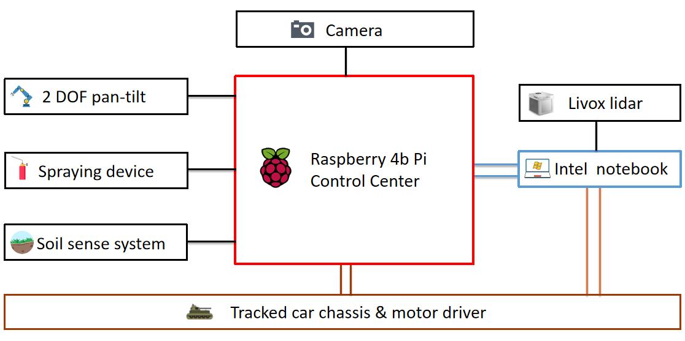
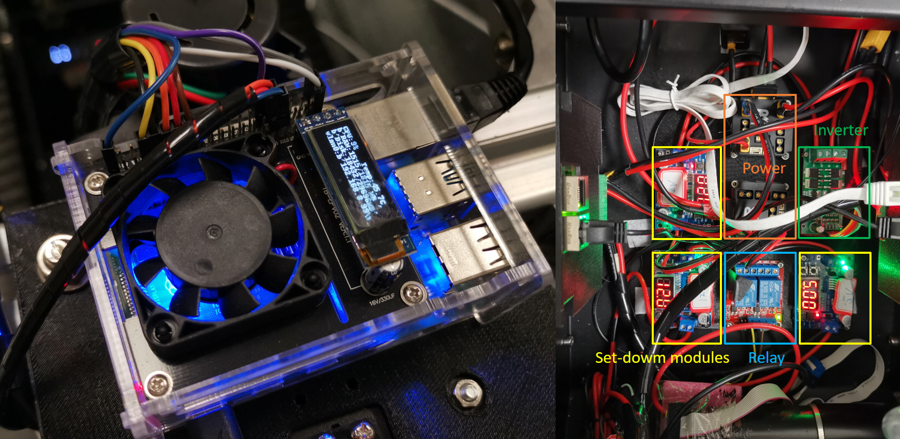
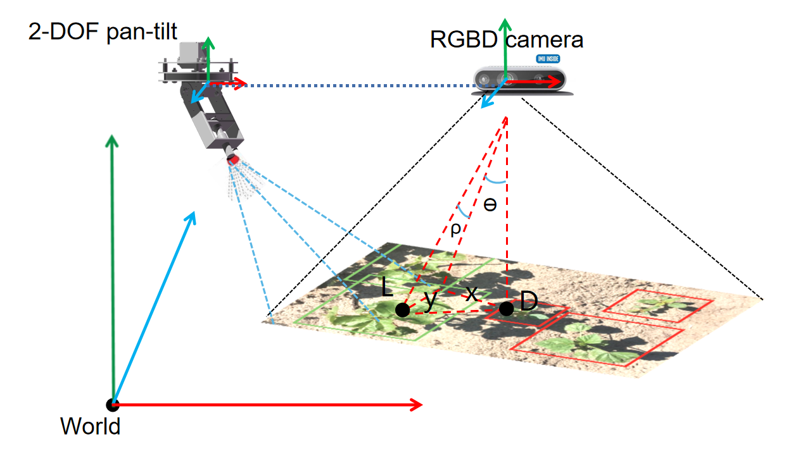
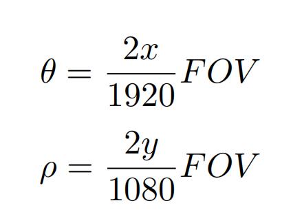
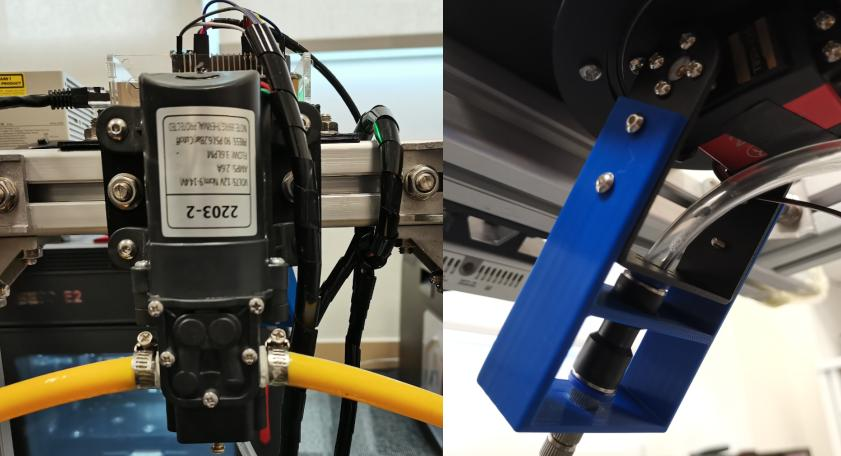
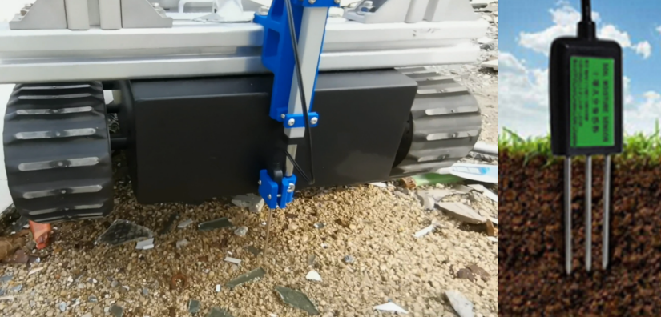

# Electrical-function-diagram
# Introduction
 With the development of science and technology and
social progress, agriculture has ushered in the digital
information age. Our country has initially established
a new agricultural system of automatic farming and
information management. The future agriculture must
be an important foothold of robot automation industry,
the use of automation technology can greatly improve the
efficiency of farming and reduce labor costs, and solve
the contradiction of labor shortage. Precision agriculture
is an important part of agricultural automation. It
implements more appropriate planting and maintenance
methods for different cultivated crops, so as to improve
the planting quality and market competitiveness of
agricultural products. 

# Automatic alignment of pan-tilt to spray
## alignment method 
1. The camera will monitor and recognize the scene in real time. When weeds come into the camera’s field of view, the computer will accurately identify them and
mark the location information of weeds.  

2. After calculation and conversion, the target Angle information will be fed back to the cradle head for aiming。 

3. Location statement:  

## spray device
hardware list: 
12v setdowm module, Optically coupled relay(5v),12w pump 2203-2, nozzle 
A high/low level signal to control the relay that the pump would work. 

# Soil senser system
The push rod above the sensor is stretched by the forward
or reverse control of the voltage. we use two-way drive axle.

